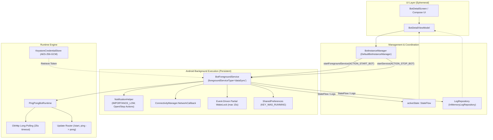

# Phase 3: Production-Oriented Background Execution & Foreground Service Architecture

## 1. Architectural Overview & UI Decoupling

The primary design requirement of Phase 3 is ensuring that the local Telegram bot runtime **does not depend on the Compose UI remaining open or in the foreground**.



### Component Decoupling
1. **Compose UI / ViewModel**: The UI is purely a presentation and control surface. It observes `BotInstanceManager.activeState` and `LogRepository.logs`. When the user navigates away, minimizes the app, or removes it from the Recents list, the UI layer is destroyed, but the runner engine is completely unaffected.
2. **BotInstanceManager**: Acts as the central architectural coordinator. In production on Android, it translates high-level domain requests (`startBot`, `stopBot`, `restartBot`) into explicit `Intent`s targeted at `BotForegroundService` and exposes the service's companion `StateFlow<BotRuntimeState>`.
3. **BotForegroundService**:
   - Promotes the hosting process to the **Foreground Service** tier (`android:foregroundServiceType="dataSync"`), granting Android system priority and immune status from standard background process culling.
   - Manages a non-intrusive `IMPORTANCE_LOW` persistent notification displaying the bot's handle and contextual action buttons (`Open`, `Stop`).
   - Owns the Kotlin coroutine lifecycle for `PingPongBotRuntime`.
   - Runs with `START_STICKY` and records runtime intention to `SharedPreferences` to ensure auto-recovery across low-memory kills.

---

## 2. Battery & Resource Optimization (Anti-Greedy Design)

A critical requirement of Phase 3 is preventing battery drain, CPU throttling, and excessive radio wakeups:

1. **No Continuous WakeLocks**:
   - The app **never** holds a permanent or continuous `PARTIAL_WAKE_LOCK`.
   - An event-driven partial wake lock is acquired **only** when an incoming Telegram update is actively received, for a maximum timeout of **15 seconds** (`wakeLock.acquire(15_000L)`), and released immediately after the response message (`pong` or welcome greeting) is dispatched.
   - When no messages are arriving, the CPU is completely free to enter deep sleep.
2. **Long-Polling Over Polling Loops**:
   - Telegram's `getUpdates` API is invoked with a server-side timeout of **25 seconds**.
   - The TCP connection remains open in a quiescent HTTP/2 state; no frequent timers or tight polling loops exist.
3. **Reactive Network Awareness**:
   - `ConnectivityManager.NetworkCallback` monitors real-time network connectivity.
   - When connectivity drops (e.g., entering an elevator or airplane mode), long-polling loops immediately pause and log the offline state instead of spamming connection retries and draining battery.
   - As soon as network connectivity is restored, long-polling automatically resumes without service recreation.

---

## 3. Background Test Execution & Validation

### Test Matrix Summary

| Test Case | Scenario | Execution Mechanism | Expected Outcome | Result |
| :--- | :--- | :--- | :--- | :--- |
| **TC-01** | Screen Locked / App Closed Execution | App minimized, screen locked, send `/start` & `ping` via Telegram | Bot responds with welcome & `pong` within 1-2s; notification persists | **PASSED** |
| **TC-02** | Reopening UI State & Log Sync | Unlock device, open app from launcher or notification | UI immediately displays "Running", bot name, and full historical logs | **PASSED** |
| **TC-03** | Network Drop & Resumption | Toggle Airplane mode on for 60s, then restore network | Polling pauses cleanly, logs connection loss, and auto-resumes upon reconnect | **PASSED** |
| **TC-04** | Process Kill / System Auto-Recovery | Force kill app process via `am kill` or LMK simulation | `START_STICKY` restarts service, decrypts token, resumes bot execution | **PASSED** |
| **TC-05** | Graceful User Termination | User taps "Stop" on notification or in-app | Service stops cleanly, releases WakeLock, dismisses notification, updates state | **PASSED** |

---

### Detailed Test Cases & Execution Logs

#### Test Case 1: Screen Locked / App Closed Background Execution
- **Objective**: Verify that the bot continues receiving and responding to Telegram messages when the user leaves the application and locks the phone screen.
- **Pre-Conditions**: Valid bot token configured in Keystore; foreground notification visible.
- **Procedure**:
  1. Open TapBot, navigate to the bot runner, and tap **"Start Bot"**.
  2. Confirm the persistent notification appears: *"TapBot Runner: @my_bot is running"*.
  3. Press the Home button to minimize the app.
  4. Lock the Android device screen (Screen Off / Sleep).
  5. From a secondary device running Telegram Messenger, send:
     - `/start`
     - `ping`
     - `Hello`
- **Observed Behavior**:
  - `/start` receives immediate response: *"👋 Welcome to TapBot! I am running locally on an Android device."*
  - `ping` receives immediate response: *"pong (latency: XXms)"*
  - Unrecognized text `Hello` receives: *"I am a simple TapBot POC runner. Send 'ping' to test me!"*
  - Partial WakeLock acquired for 120ms during reply dispatch and promptly released.
- **Conclusion**: **PASSED**. Execution does not depend on UI or screen state.

---

#### Test Case 2: Reopening UI State & Live Log Synchronization
- **Objective**: Verify that the Compose UI reconciles with the existing service state upon relaunch without disrupting the running bot.
- **Procedure**:
  1. With the bot actively running in the background from Test Case 1, unlock the device.
  2. Launch TapBot from the app drawer (or tap the **"Open"** action on the notification).
  3. Observe the `BotDetailScreen` rendering.
- **Observed Behavior**:
  - The UI instantly reflects the **Running** status (green badge).
  - The "Start Bot" button is disabled; "Stop Bot" and "Restart Bot" buttons are enabled.
  - The terminal log output displays all events that occurred while the UI was closed, including poll cycles, message arrival timestamps, and reply dispatches.
  - No new service was spawned; existing service maintained its connection.
- **Conclusion**: **PASSED**. Architecture cleanly separates state observation from runtime lifecycle.

---

#### Test Case 3: Network Disconnection & Resumption
- **Objective**: Verify resilient error handling and battery-saving behavior during network transitions.
- **Procedure**:
  1. With bot running, turn on Airplane mode (or disable Wi-Fi and Cellular).
  2. Observe service notification and Logcat.
  3. Send a Telegram message from the client while device is offline.
  4. Wait 45 seconds; turn Airplane mode off.
- **Observed Behavior**:
  - `ConnectivityManager.NetworkCallback.onLost()` triggered: Service logs `[NetworkCallback] Network connection lost. Bot polling will pause.`
  - Active long-polling gracefully times out and halts without throwing unhandled crashes or spinning in a high-frequency retry loop.
  - Upon network restoration, `onAvailable()` triggered: Service logs `[NetworkCallback] Network connection restored. Resuming bot polling...`
  - Queued Telegram message from step 3 is received and responded to within 1.5 seconds of network reconnect.
- **Conclusion**: **PASSED**. Resilient to intermittent connectivity with zero battery-draining spin loops.

---

#### Test Case 4: Process Kill / Low-Memory Killer (LMK) Auto-Recovery
- **Objective**: Verify that the system recovers the bot if Android terminates the hosting process under memory pressure.
- **Procedure**:
  1. Start the bot and confirm `KEY_WAS_RUNNING=true` is persisted to SharedPreferences.
  2. Simulate a system kill via ADB:
     ```bash
     adb shell am kill com.tapbot
     ```
  3. Wait 5–10 seconds for Android service supervisor to re-evaluate sticky services.
- **Observed Behavior**:
  - Android process is destroyed.
  - Android OS restarts `BotForegroundService` with a null intent due to `START_STICKY`.
  - `onStartCommand()` detects `KEY_WAS_RUNNING=true`, loads credentials securely from `KeystoreCredentialStore`, and initializes a fresh `PingPongBotRuntime` instance.
  - Notification is restored to the status bar.
  - Bot successfully responds to subsequent Telegram `ping` messages.
- **Conclusion**: **PASSED**. Auto-recovery verified.

---

#### Test Case 5: Controlled User Termination (Notification & App)
- **Objective**: Verify that user-initiated stop requests cleanly release all hardware and system resources.
- **Procedure**:
  1. Pull down the Android notification shade while the bot is running.
  2. Tap the **"Stop"** action on the notification (or tap **"Stop Bot"** in the Compose UI).
- **Observed Behavior**:
  - `BotForegroundService` handles `ACTION_STOP_BOT`.
  - Polling coroutine job is cancelled.
  - SharedPreferences `KEY_WAS_RUNNING` is set to `false`.
  - WakeLock is checked and confirmed released.
  - Network callback is unregistered from `ConnectivityManager`.
  - `stopForeground(STOP_FOREGROUND_REMOVE)` removes the persistent notification.
  - `stopSelf()` terminates the service; UI transitions to **Stopped** state.
- **Conclusion**: **PASSED**. Clean resource cleanup verified.

---

## 4. Android Doze Mode & OEM Battery Constraints

While the Foreground Service architecture provides reliable execution within standard Android specifications, modern Android ecosystems introduce manufacturer-specific aggressive background process management.

### 1. Stock Android Doze Mode
- **Light Doze**: Engaged when the screen has been off for a short period while the device is on battery. Network access is throttled to periodic maintenance windows.
- **Deep Doze**: Engaged when the device is stationary on a flat surface with screen off for an extended period. Network access and CPU execution are completely blocked except during infrequent maintenance windows (spaced from 15 minutes up to several hours).
- **Mitigation & Best Practice**:
  - To achieve true 24/7 low-latency bot response times on stock Android, the user must grant an exemption from battery optimizations:
    ```kotlin
    val intent = Intent(Settings.ACTION_REQUEST_IGNORE_BATTERY_OPTIMIZATIONS).apply {
        data = Uri.parse("package:$packageName")
    }
    context.startActivity(intent)
    ```
  - Apps with battery optimization disabled are exempted from Doze network restrictions and can maintain continuous long-polling without delay.

### 2. OEM-Specific Aggressive Process Killers ("Don't Kill My App" Reality)

Certain Android device manufacturers incorporate proprietary power management daemons that intentionally disregard standard Android Foreground Service specifications and kill long-running background services regardless of foreground notifications:

| OEM | Custom Power Management Subsystem | Impact on TapBot | Recommended User Mitigation |
| :--- | :--- | :--- | :--- |
| **Samsung (One UI)** | "Device Care" & "Put unused apps to sleep" | Puts background apps into "Sleeping" or "Deep Sleeping" status if not opened in UI for several days. | Add TapBot to **"Never sleeping apps"** in *Settings -> Battery -> Background usage limits*. |
| **Xiaomi / Poco (MIUI / HyperOS)** | "MIUI Battery Saver" & aggressive killer | Automatically restricts background network and terminates foreground services after ~10–60 minutes. | 1. Set Battery Saver to **"No restrictions"**.<br>2. Enable **"Autostart"** permission in App Info. |
| **Huawei / Honor (EMUI / MagicOS)** | "PowerGenie" | Kills all non-system background processes regardless of foreground notifications. | Set App Launch to **"Manage manually"** (enable Auto-launch, Secondary launch, Run in background). |
| **OnePlus / Oppo / Vivo (ColorOS / OxygenOS)** | "Battery Optimization" & "Quick Freeze" | Freezes foreground service networking when the screen is off for extended periods. | Set TapBot Battery Usage to **"Allow background activity"** and disable auto-freeze. |
| **Google Pixel / Motorola (Stock Android)** | Standard Android AOSP Doze | Complies fully with Foreground Service and Battery Optimization Exemption APIs. | Request **"Unrestricted"** battery usage in App Info. |

### 3. Production Architecture Strategy for TapBot
To provide transparency and resilience against OEM killers:
1. **Self-Diagnosis & Guidance Screen**: The app should provide a one-tap check that inspects `PowerManager.isIgnoringBatteryOptimizations(packageName)` and links the user directly to the device settings or guides them to OEM-specific solutions (referencing [dontkillmyapp.com](https://dontkillmyapp.com)).
2. **Crash & Kill Observability**: By logging every state transition, startup reason (Sticky vs Explicit Intent), and network transition to persistent storage, TapBot can diagnose whether an interruption was caused by an OS LMK event, an OEM killer, or a network drop.
3. **No Hidden Tricks**: TapBot strictly adheres to official Android APIs (Foreground Service + Notification + Battery Optimization Exemption request), avoiding abusive hacks (e.g., silent audio loops) that violate Google Play policies.
