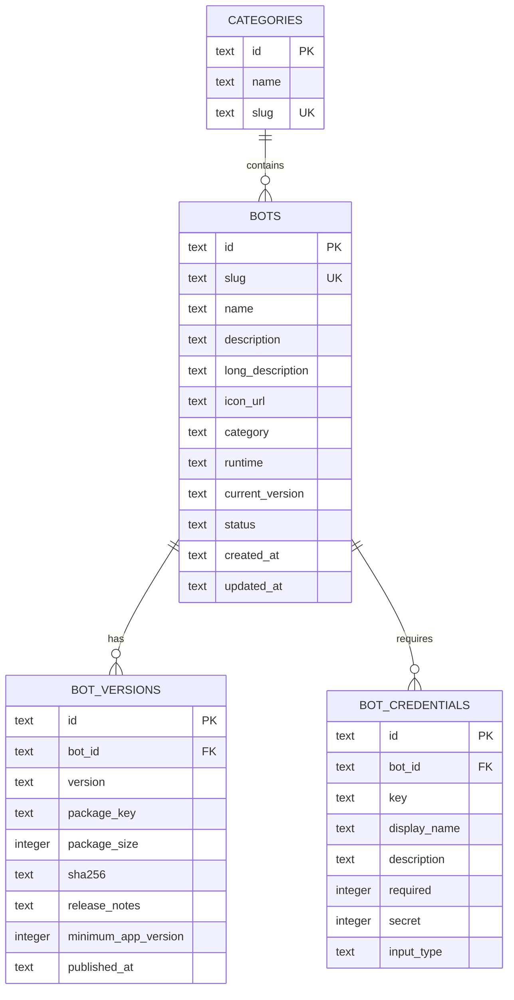

# TapBot Catalog & Package Backend

A serverless, edge-deployed catalog and package distribution backend for **TapBot**, built on **Cloudflare Workers**, **Cloudflare D1** (distributed SQLite), and **Cloudflare R2** (object storage).

---

## 1. Architectural Principles

> [!IMPORTANT]
> **The backend DOES NOT execute or host Telegram bots.**
> Telegram bots run locally on user Android devices (via the Android Native ART Coroutine Runner and Foreground Service).

The backend serves strictly as a **curated publication and distribution system**:
- **Bot Catalog & Metadata**: Categorization, descriptions, tags, icon URLs, and runtime compatibility specifications.
- **Credential Requirements**: Dynamic schema of credentials required by each bot (e.g. Telegram Bot Token, Gemini API Key, Target Channel ID).
- **Versioning & Releases**: Version semver, release notes, minimum Android app version, and package hash (`sha256`).
- **Package Distribution**: Compiled `.botpkg` archives hosted securely on Cloudflare R2 and served via the edge worker.
- **Zero Token Storage**: User Telegram bot tokens **never touch this backend or D1**. Tokens are managed strictly on-device in Android Keystore.
- **Zero Admin Secrets in Client**: The Android app contains no administrative keys or write permissions.

---

## 2. Technology Stack

- **Runtime**: [Cloudflare Workers](https://workers.cloudflare.com/) (V8 isolates at the edge)
- **Database**: [Cloudflare D1](https://developers.cloudflare.com/d1/) (Serverless distributed SQLite)
- **Object Storage**: [Cloudflare R2](https://developers.cloudflare.com/r2/) (Zero-egress S3-compatible storage)
- **Language & Tooling**: TypeScript 5.7, Node.js 20+, Wrangler CLI, Vitest

---

## 3. Database Schema (Cloudflare D1)



### Table Definitions
1. **`categories`**: Catalog taxonomy (`id`, `name`, `slug`).
2. **`bots`**: Core bot records. `status` is `'draft'`, `'published'`, or `'archived'`.
3. **`bot_versions`**: Immutable version releases with R2 `package_key`, byte size, and `sha256` integrity hashes.
4. **`bot_credentials`**: Dynamic input specifications rendered by the Android app's setup wizard without code modifications.

---

## 4. Local Development & Setup

### Prerequisites
- Node.js `v20.0.0+` (v24 tested)
- npm `v10.0.0+`
- Cloudflare account with Workers, D1, and R2 enabled

### 1. Install Dependencies
```bash
cd backend
npm install
```

### 2. Apply Local D1 Database Migrations
Wrangler creates a local SQLite database in `.wrangler/state/v3/d1` and runs migrations:
```bash
npm run db:migrate:local
```
This executes:
- `migrations/0001_initial_schema.sql` (table definitions and indexes)
- `migrations/0002_seed_data.sql` (sample categories, published bots, versions, credentials)

### 3. Run Test Suite
```bash
npm test
```
Runs 11 automated integration tests in Vitest validating:
- CORS preflight and headers
- Public catalog listings and filters
- Single bot detail retrieval
- Version history
- Admin authentication enforcement
- Admin bot creation, update, publish/unpublish, and versioning
- R2 package uploads and downloads

### 4. Start Local Development Server
```bash
npm run dev
```
The server will run at `http://127.0.0.1:8787`.
> **Android Emulator Note**: From the Android emulator, access this local server via `http://10.0.2.2:8787`.

---

## 5. Environment Variables & Secrets

Configured in `wrangler.toml` and Cloudflare dashboard:

| Variable | Type | Description | Local Default |
| :--- | :--- | :--- | :--- |
| `ADMIN_API_KEY` | Secret | Master key required for all `/api/v1/admin/*` mutations | `dev-admin-secret-key-change-in-prod` |
| `ENVIRONMENT` | Var | Environment identifier (`development`, `staging`, `production`) | `development` |
| `DB` | D1 Binding | Binding to `tapbot_catalog` database | Defined in `wrangler.toml` |
| `BUCKET` | R2 Binding | Binding to `tapbot-packages` bucket | Defined in `wrangler.toml` |

In production, set the secret securely via Wrangler:
```bash
wrangler secret put ADMIN_API_KEY
```

---

## 6. Cloudflare Production Deployment

### Step 1: Create Remote Cloudflare Resources
```bash
# 1. Create remote D1 database
wrangler d1 create tapbot_catalog
# (Copy the generated database_id into wrangler.toml under [[d1_databases]])

# 2. Create remote R2 bucket
wrangler r2 bucket create tapbot-packages

# 3. Set the production Admin Secret
wrangler secret put ADMIN_API_KEY
```

### Step 2: Apply Remote Database Migrations
```bash
npm run db:migrate:prod
```

### Step 3: Deploy Worker
```bash
npm run deploy
```

---

## 7. API Documentation

All API responses follow a consistent envelope structure:

**Success Response**:
```json
{
  "success": true,
  "data": { ... }
}
```

**Error Response**:
```json
{
  "success": false,
  "error": {
    "code": "ERROR_CODE",
    "message": "Human readable message"
  }
}
```

### Public Endpoints (`/api/v1/...`)

#### 1. `GET /api/v1/categories`
Returns list of available bot categories.

#### 2. `GET /api/v1/bots`
Returns list of published bots.
- **Query Parameters**:
  - `category` *(optional)*: Filter by category slug (e.g. `utilities`, `productivity`).
  - `search` *(optional)*: Case-insensitive search on bot name, description, or slug.

#### 3. `GET /api/v1/bots/:id`
Returns complete details for a single published bot, including required credentials and current version package details.
- `:id` can be either the primary `id` (e.g. `bot_ping_pong`) or `slug` (e.g. `ping-pong-bot`).

#### 4. `GET /api/v1/bots/:id/versions`
Returns full version release history and changelog for a bot, sorted by `published_at DESC`.

#### 5. `GET /api/v1/packages/:key`
Streams the compiled `.botpkg` binary archive directly from Cloudflare R2 storage with immutable cache headers and `Content-Disposition`.

---

### Admin Endpoints (`/api/v1/admin/...`)

> [!WARNING]
> All admin endpoints require authentication. Provide your secret via:
> - `Authorization: Bearer <ADMIN_API_KEY>` or
> - `X-Admin-Key: <ADMIN_API_KEY>`

#### 1. `POST /api/v1/admin/bots`
Create a new bot in `draft` status.
```json
{
  "slug": "translator-bot",
  "name": "Live Translator",
  "description": "Translates chat messages across 50 languages in real time.",
  "longDescription": "Runs locally on your device...",
  "iconUrl": "https://example.com/icon.png",
  "category": "utilities",
  "runtime": "native_art"
}
```

#### 2. `PUT /api/v1/admin/bots/:id`
Update bot metadata (`name`, `description`, `iconUrl`, `category`, etc.).

#### 3. `DELETE /api/v1/admin/bots/:id`
Delete a bot and cascade-delete all its versions and credentials.

#### 4. `POST /api/v1/admin/bots/:id/publish`
Publishes a draft bot, making it instantly visible in the public catalog.

#### 5. `POST /api/v1/admin/bots/:id/unpublish`
Reverts a published bot back to `draft` status.

#### 6. `POST /api/v1/admin/bots/:id/versions`
Registers a new version release and updates the bot's `current_version`:
```json
{
  "version": "1.2.0",
  "packageKey": "packages/translator_1.2.0.botpkg",
  "packageSize": 28410,
  "sha256": "4a5c9b...",
  "releaseNotes": "Added support for German and Spanish",
  "minimumAppVersion": 1
}
```

#### 7. `POST /api/v1/admin/bots/:id/credentials`
Registers a required or optional credential field for a bot:
```json
{
  "key": "bot_token",
  "displayName": "Telegram Bot Token",
  "description": "Obtained from @BotFather",
  "required": true,
  "secret": true,
  "inputType": "password"
}
```

#### 8. `PUT /api/v1/admin/packages/:key`
Uploads the raw `.botpkg` binary package directly into Cloudflare R2:
```bash
curl -X PUT "https://api.tapbot.dev/api/v1/admin/packages/packages/my_bot_1.0.0.botpkg" \
     -H "Authorization: Bearer $ADMIN_API_KEY" \
     -H "Content-Type: application/octet-stream" \
     --data-binary "@my_bot_1.0.0.botpkg"
```

---

## 8. Android Client Integration

The Android application connects to this backend via [`CloudflareCatalogApi`](file:///c:/Users/varshan/Downloads/projects/tapbot/core/network/src/main/java/com/tapbot/core/network/CloudflareCatalogApi.kt) inside `:core:network`.

- **Automatic Fallback**: If network is disconnected or the backend is offline during development, `CloudflareCatalogApi` gracefully falls back to local cache / mock catalog items to ensure uninterrupted UI previews.
- **Dynamic Credentials Rendering**: The Android app parses `credentials` from `/api/v1/bots/:id` and renders secure masked input fields dynamically, encrypting the user's input directly into Android Keystore (`AES256-GCM`).
